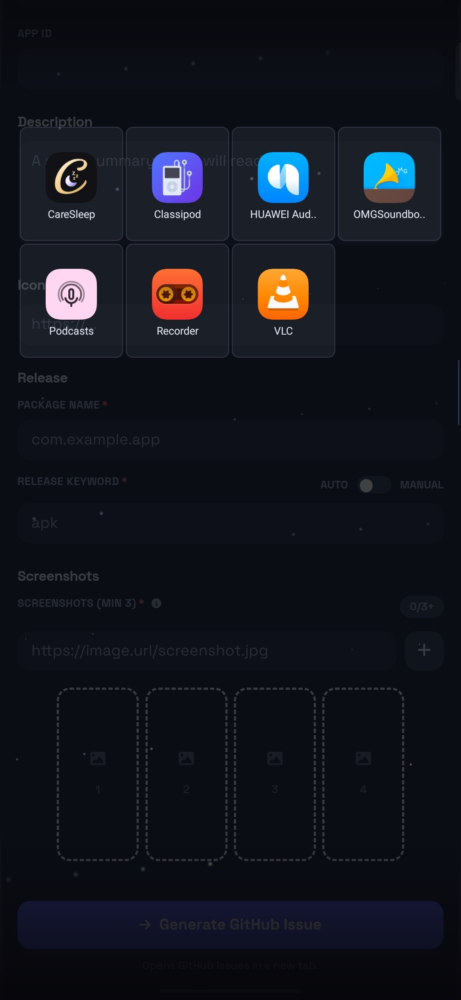
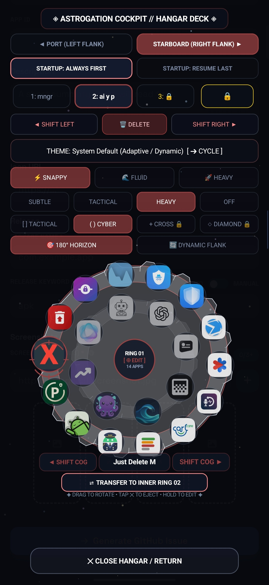
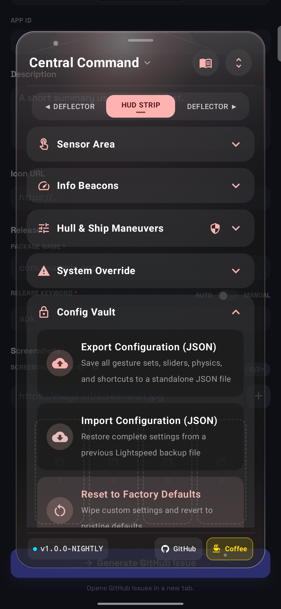

# 🚀 Lightspeed

**A control layer, launcher, and workstation for Android.**

Android's foundation is Linux.

Moving between different devices or changing your Android device shouldn't mean losing capabilities because of artificial rules or restrictions imposed by the software layer built on top.

Lightspeed is about taking back control and enhancing the way you interact with your device without making you choose between Lightspeed's implementations and your OEM's own implementations.

Lightspeed's Central Command provides a polished portal for configuring navigation, hardware interaction, setting up information beacons, and utilizing built-in system controls, aka System Override, the way that suits you and your Android.

---

# 🚀 One Launch Pad, Three Workstations

## 🛰️ The Launch Pad

The **Astrogation Core** — or simply the sidebar — is your way into the three main areas of Lightspeed.

### 1. 🌌 Category Cruise

The categorized app drawer.

To browse the categories, move your finger up and down the **Astrogation Core**. To browse a specific category, swipe horizontally while said category is in focus without lifting your finger.

Your position within the **Category Cruise**, or the focused item within the chosen category, is calculated relative to where your finger is on your specific screen dimensions. No matter where you're planning to make the jump from or back to the **Category Cruise**, you will always find it easy to navigate the whole app drawer with your thumb without lifting it.

To cancel the gesture at any point, swipe your finger back to the **Astrogation Core** or the edge of the screen.

 

  

🌠 <em>Category Cruise — kinetic app browsing with live icon grid</em>

### 2. ⚙️ Cockpit

A configurable workspace built around **Cockpit Gear Sets** and the **Action Selection Menu**.

Each Gear Set contains two gears with a rotating **Cockpit Hangar** at the center, represented by a rotating reticle. A separate fixed reticle remains non-rotating, dead locked onto the currently focused item.

The **Action Selection Menu** is Lightspeed's global selection interface for choosing what gestures, hardware maneuvers, or Gear Set items map to.

At the top is an accordion dedicated to **System Actions**, including actions that utilize Shizuku, such as gracefully closing an app and switching to the previous app. It also provides direct shortcuts to the **Perimeter Watchdog** and **Core Watchdog**.

Below that, frequently used apps can be pinned at the top for easier access. For example, **MacroDroid, Tasker, Key Mapper, and Shortcut Maker** are pinned by default if they are installed. Any app accordion can be pinned or unpinned by a long press.

For each app, Lightspeed attempts to provide its available app shortcuts, home-screen launcher shortcuts, and deep activities. An app can be launched directly by tapping its accordion title or icon, or its accordion can be expanded to choose from the aforementioned options.

The Action Selection Menu also features Lightspeed's distinctive take on an indexed scrollbar. It can be interacted with either by tapping the index or by sliding along it. While interacting with the index bar, a HUD displays the first two letters corresponding to the current alphabetical position, making it clear where you are within the app list.

 

  

⚙️ <em>Cockpit Hangar — dual orbital gear rings with full tactile eject, rotate &amp; edit controls</em>

### 3. 🛰️ Central Command

Central Command can be accessed directly by tapping the **Lightspeed app icon**, or from the **Astrogation Core**. While cruising the categories by swiping down the Astrogation Core, Central Command remains hidden behind the bottom-most category. Swipe a little further toward the bottom to reveal it, accompanied by a subtle **haptic cue**.

 

  

🛰️ <em>Central Command — HUD Strip, Sensor Area, Hull &amp; Ship Maneuvers, System Override &amp; Config Vault</em>

The **Central Command floating window's header area** is interactive in three ways. You can swipe down on the header area to dismiss the floating window. The **Central Command title** can be single-tapped or long-tapped: a long tap quickly toggles the entire Lightspeed system on or off. The **Guidebook icon** can likewise be single-tapped or long-tapped. There is also the plain old **Expand/Collapse All** button for expanding or collapsing the accordions in the current tab.

For customizing the **Central Command theme**, tap the Central Command title. For organizing or changing how the accordions are arranged within a specific tab, tap the **tab title while it is in focus** — whether it is the **HUD STRIP, Left DEFLECTOR, or Right DEFLECTOR**.

The **Flight Control Deck** is organized into three cards. The first card contains the aforementioned **theme engine** for Central Command and different ways of toggling Lightspeed as a whole or in part.

The second card contains the **Core Watchdog**. It keeps Lightspeed alive through three possible methods and includes the **Black Box**:

1. **Auto Revival** — when Lightspeed crashes, it triggers an auto-revival message utilizing Shizuku. **Enabled by default.**
2. **Periodic Check** — every 20 seconds, it checks whether Lightspeed is still alive and operational.
3. **Deep Sleep Prevention** — prevents Android from entering deep sleep, helping keep Lightspeed continuously active. *(Dev note: add a toggle for this that's off by default and protected by a seven-tap first-time warning.)*
4. **Black Box** — keeps a lightweight record of the latest Lightspeed crash or action failure, which can be copied and pasted into GitHub issues for easier troubleshooting.

The **Core Watchdog** also contains a **Material 3 mini-card/button labeled “Services.”** Pressing it opens the **Perimeter Watchdog**, where the accessibility services of your apps can be toggled more conveniently than through Android's built-in settings page. Each service can also be **shielded** and have its battery exemption whitelisted or revoked using two dedicated buttons directly beneath it.

The **Perimeter Watchdog** also contains a **light-blue Material 3 mini-card/button labeled “Exempt More Apps.”** Pressing it opens the **Exempt More Apps floating window**, providing a more accessible way to whitelist or revoke apps from Android's native battery-management exemption system.

**Both the Core Watchdog and Perimeter Watchdog are not 100% bulletproof and should be treated accordingly.**

There are also dedicated **System Actions** for launching the **Perimeter Watchdog** window and the **Core Watchdog** card directly. By default, these are assigned to the **left and right swipes of the HUD STRIP sensor area**, respectively, providing quick access without having to navigate through Central Command.

The **third card** provides another way to toggle Lightspeed as a whole or in part.

---

## 📡 Gesture Sensor Areas (HUD STRIP & DEFLECTORS)

The **HUD STRIP** tab contains the **Sensor Area** accordion for the status-bar gesture area. The **Left DEFLECTOR** and **Right DEFLECTOR** tabs contain the settings for the left and right edges of your screen, respectively. These are sensor areas for the gestures you perform along the edges of your screen.

There is a lot of customization and plenty to explore here, especially with the **Action Selection Menu**.

### 🪢 The Rope

Each DEFLECTOR has a **Unified Deflectors** accordion, reflecting how each side of the screen can be treated as either one unified gesture area or two separate controls.

Inside it, the **Unified Gesture Matrix** contains one entry for each gesture. Each gesture entry has its own **Rope**. When the Rope is tethered, that gesture is configured as one unified control across the upper and lower portions of the DEFLECTOR.

Tap the Rope to untether it. The gesture entry is then duplicated into separate **upper** and **lower** gesture entries, which move into the **Separate DEFLECTOR Controls** sub-accordion. From there, each half can be configured independently—for example, using the upper **tap-and-hold** gesture to control brightness and the lower one to control volume.

Long-pressing the Rope sends the current gesture mapping to the opposite DEFLECTOR. It is simply a one-time copy-and-paste operation—not a persistent mirror or synchronization.

---

## 🌌 Advanced Flight Avionics

The **HUD STRIP** comes with a set of configurable accordions for additional flight controls, information, and system tools. Their default arrangement is:

### 1. Sensor Area

The **Sensor Area** is the status-bar gesture area described above. Its gestures are fully customizable through the **Action Selection Menu**.

### 2. Info Beacons

**Info Beacons** contains the **Horizon Rail** and the **Central Capsule**.

The **Horizon Rail** is a progress line for downloads and currently playing media. It is limited to one line by default, but can be expanded to up to three lines. It can also display the name of the currently playing media, which can be particularly useful on tablets and other larger displays where the center of the status bar provides additional space. **Horizon Rail is disabled by default.**

The **Central Capsule** is a lightweight implementation of an interactive capsule around the camera punch-hole. It offers several interactive features, but development has been deliberately deprioritized as many Android devices now provide their own implementations. It remains available for experimentation and may receive further development in the future. **Central Capsule is disabled by default and has been moved to Experimental Labs.**

### 3. Hull & Ship Maneuvers

**Hull & Ship Maneuvers** provides the **Volume Key Matrix** and **Back-Tap Gesture** mappings.

It also includes safeguards intended to preserve Android's native volume- and power-button functions, including OEM-specific gestures such as screenshots and accessibility-service shortcuts. These behaviors vary between manufacturers and Android skins—for example, Samsung and Infinix XOS implement their accessibility shortcuts differently.

### 4. System Overrides

**System Overrides** contains **Native Edge Gesture Sovereignty**, which can neutralize Android's native edge gestures so that the **DEFLECTORS** have full control over those gesture areas.

It also provides controls for **Animation Speed**, **Display Metrics (DPI)**, and **Font Scale**.

Because these are native Android system settings commonly associated with Developer Options, Lightspeed treats their sliders cautiously. Tapping directly on a slider track to jump to a value is disabled by default. Long-press the value box to reveal the **Precision Control & Presets** mini window, which contains the **Tap to Jump on Track** toggle. This can then be enabled when desired.

The sliders also support fine adjustment. Moving a finger across the slider normally follows the default, coarse steps. Moving the finger vertically while scrubbing horizontally makes the adjustment finer.

Tapping the value box itself restores that setting to its default value.

### 5. Config Vault

**Config Vault** contains Lightspeed's backup, export, and factory-reset controls, allowing the configuration to be preserved, exported, or restored to its defaults.

### 6. Experimental Labs

**Experimental Labs** contains features that are **disabled by default** and should be used at the user's own discretion.

This includes experimental features such as the **Central Capsule**, **Refueling Bay**, **Power Button Remapping**, **Core Coding Schedule**, and **Omniscient Audio Deck**.

The **Refueling Bay** is a functional charging-dock screen designed to show charging speed while giving you a dedicated space for your favorite widgets. It also displays the clock and supports two widget orientations, each with its own widget arrangement. It can be particularly useful as a manually launched charging display—for example, showing charging speed alongside a calendar and task widgets.

Because the Refueling Bay currently darkens the display using a dark overlay rather than physically turning the screen off after a timeout, it is **not recommended for OLED displays**. It is therefore kept in Experimental Labs. If you want to use it, launch it manually or assign a gesture to it through the **Action Selection Menu → System Actions → Ship Maintenance**.

**Power Button Remapping** launches the assigned action without attempting to block the device's native power-button behavior.

The remaining experimental features are unfinished or currently non-functional and are best treated accordingly.

Experimental features are best treated as exactly that: experiments. The **HUD STRIP swipe-down gesture** may require making the Sensor Area thicker and keeping the swipe-down distance roughly equal to its thickness, so that Android's native status-bar pull-down gesture is not triggered unintentionally.

---

## 🔐 Permissions & Elevated Capabilities

Lightspeed can technically operate using **Android's Accessibility Service alone**, without Shizuku. However, from day one, Lightspeed has been designed with **Shizuku in mind**.

Without Shizuku, Lightspeed may still provide its core accessibility-based gesture functionality, but a significant portion of its intended system-level capabilities becomes unavailable. In practical terms, the result can border on a **semi-functional version of Lightspeed** rather than the complete experience the application was designed to provide.

### Accessibility Service

The Accessibility Service is the foundation of Lightspeed's gesture system. It allows Lightspeed to detect gestures across the screen, perform global navigation actions such as **Back, Home, and Recents**, and provide the gesture sensor areas used by the **HUD STRIP** and **DEFLECTORS**.

It also allows Lightspeed to interact with supported system controls and maintain its gesture-driven interface while other applications are in the foreground.

### Shizuku

**Shizuku** is therefore highly recommended. It provides Lightspeed with elevated Android capabilities without requiring root and is an integral part of the application's design.

Among other things, Shizuku enables:

- **Previous App Switching** — Switch directly between recent applications without passing through the launcher's **recent apps menu**.
- **Graceful Task Closer** — Close the active application through a graceful task-removal mechanism rather than relying on the OEM's recent-apps gesture. This distinction matters on heavily customized Android systems where swiping an application away from the recent apps menu may be interpreted as a **force stop**. Graceful Task Closer is intended to avoid that behavior where possible, which can be particularly useful for applications such as Termux that may otherwise be disrupted by aggressive OEM task-management behavior. The implementation is still **not 100% bulletproof against OEM task killing or other system-level process management**.
- **Split Screen, Freeform & OEM-Specific Pop-Up Windows** — Launch supported applications into split-screen, freeform, or OEM-specific pop-up windows, where supported by your device and its Android/OEM implementation.
- **Lightspeed First-Time Onboarding** — Assist with enabling Lightspeed's Accessibility Service and completing its initial setup without requiring the user to manually navigate through multiple Android settings screens.
- **Action Selection Menu App Discovery** — Lightspeed uses Shizuku to populate the app accordions with the launchable entries it exposes, including **app shortcuts, home-screen launcher shortcuts, and deep activities**.
  
  *(Dev note: Verify exactly which discovery mechanisms require Shizuku. In particular, determine whether Shizuku is required for app shortcuts, home-screen launcher shortcuts, deep activities, or only specific portions of this discovery process. The README should reflect the actual implementation rather than assuming Shizuku is inherently required for all of them.)*

### User-Granted Permissions

Most of Lightspeed's permissions do not require additional interaction from the user. The permissions that require user action are primarily tied to specific features:

- **Modify System Settings** — Required when using Lightspeed to modify settings such as **screen brightness** or **screen timeout**.
- **Notification Listener** — Required when enabling **Info Beacons** features that depend on notification access, such as media playback or download-progress information.

### Other Permissions

The following permissions are declared by Lightspeed but do not require a separate user-granted permission prompt under normal Android permission handling:

- **Query All Packages** — Allows Lightspeed to discover installed applications for **Category Cruise**, the **Action Selection Menu**, and related app-launching functionality.
- **Ignore Battery Optimizations** — Used for Lightspeed's battery-management and watchdog functionality where supported.
- **Vibrate** — Provides haptic feedback throughout the interface.
- **Post Notifications** — Used for notification-based status and controls, including the ability to toggle the **DEFLECTORS** and Lightspeed as a whole.
- **Call Phone** — Declared for using the **Home Screen Launcher App Shortcut** for direct contact calling, at least on supported devices such as Infinix devices.
- **Internet** — **Not declared.** Lightspeed has no `android.permission.INTERNET` permission and therefore has no network access through the standard Android networking APIs.

---

## 🛠️ Architecture & AI Development Notice

Lightspeed is built as a modular Android application, with its gesture system, configuration interface, action mapping, watchdogs, and experimental features separated into distinct components.

The project goes through regular cycles of implementation, testing, and refactoring. As part of that process, source files exceeding **400 lines** are treated as warning signs that a component may be becoming too large or carrying too many responsibilities. Files exceeding **750 lines** are treated as a critical threshold and are placed at the top of the priority list for the next refactoring cycle.

These thresholds are not strict technical limits. They are practical indicators used to keep the codebase maintainable as Lightspeed continues to grow.

### AI-Assisted Development

Lightspeed has been developed with substantial assistance from modern AI tools. This is deliberately documented here for transparency.

Different models are used for different parts of the development process:

- **Claude 4.6** — primarily used for **refactoring plans, feature planning, and architectural planning**, helping analyze the structure of the project and determine how larger changes should be approached.
- **Gemini Flash 3.6 through 3.8** — primarily used for **execution**, including implementing planned features, modifying code, and carrying out development tasks based on the architectural direction. It is also frequently used on its own for **small bug fixes and straightforward feature implementations** that do not require the larger planning models.
- **Gemini Pro 3.1** — used occasionally, and generally as a fallback, for **feature planning, refactoring plans, and architectural planning** when the primary planning-model quota is unavailable or exhausted.

This is not intended to suggest that AI independently designed or developed Lightspeed. The architecture, requirements, priorities, testing decisions, and final direction remain driven by the project's creator.

The creator does not necessarily consider themselves a traditional developer. Lightspeed began with a **dream, a need, and a perceived gap in the Android community**: a source-available tool that could provide a different approach to system-wide gestures, navigation, customization, and Android automation.

AI made it possible to turn that idea into a functioning project while making the process of learning, experimenting, refactoring, and iterating considerably more accessible.

The use of AI is therefore part of the project's development story, not something being hidden or presented as conventional software-development experience. The resulting source code remains the final authority on what Lightspeed actually does, and real-device testing remains essential—particularly for Android accessibility behavior, OEM-specific system implementations, battery management, task handling, and other areas where behavior can vary significantly between devices.

The project continues to go through regular refactoring cycles as features are added and the codebase evolves. The intention is not simply to make Lightspeed work, but to keep its implementation understandable and maintainable as it grows.

---

## 💬 Community, Issues & Support Policy

Because of a demanding offline profession, **there is no real-time chat support (Discord/Telegram) and Reddit comments/DMs are not monitored for ongoing technical triage.**

All communication, bug reporting, and regression tracking are handled strictly asynchronously via **GitHub Issues**:
- Tracking reproducible **bugs and hardware edge cases**.
- Catching **regressions** across Android OEM distributions.
- Submitting crash logs captured via the built-in crash logger in Central Command.

Feature suggestions will be cataloged into the development backlog for future milestone deployment rather than immediate release.

---

## ☕ Free & Supporter Longevity Model

The vast majority of Lightspeed is and will remain free forever. Core gesture navigation, app launching, deflectors, system overrides, and backup reliability have zero paywalls.

The **Lightspeed Infinity** tier is designed not as a restrictive constraint, but as a voluntary thank-you incentive for supporters who want to fuel ongoing development and longevity through [Buy Me a Coffee](https://buymeacoffee.com/sbflabs/e/579114). Supporter contributions unlock cosmetic perks, specialized cockpit themes, custom reticle collimators, and unlimited Cockpit Gear sets.

---

## 📄 License & Credits

- **License**: Source-available for personal, non-commercial use. See [LICENSE](LICENSE).
- **Credits & Inspirations**: Detailed acknowledgments of third-party inspirations, open-source community ethos, and required notices (including Shizuku API MIT) can be found in [CREDITS.md](CREDITS.md).
